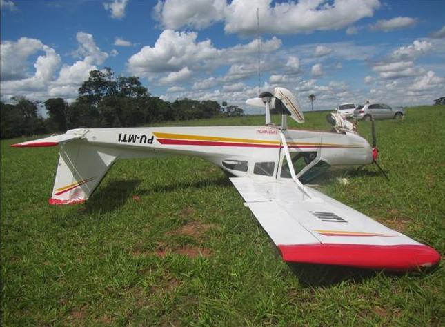
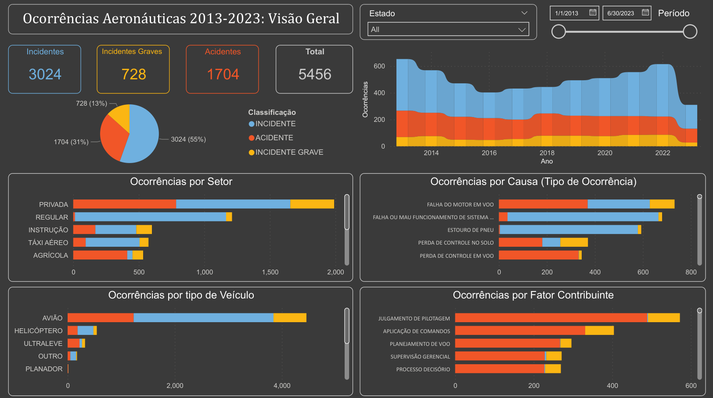
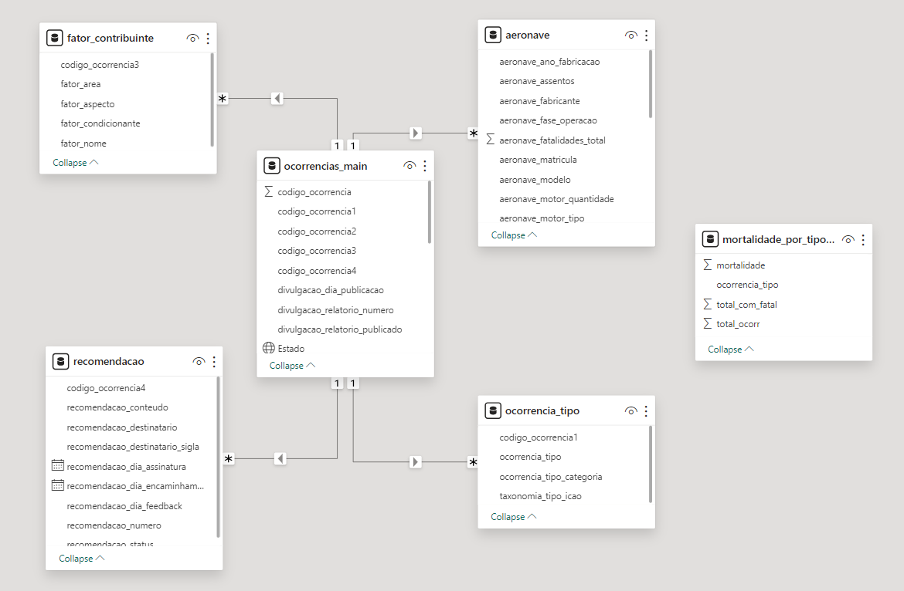

# Ocorrências Aeronáuticas 2013-2023
## Um estudo de acidententes e incidentes aeronáuticos no Brasil utilizando ***Python***, ***SQL*** e ***Power BI***

Acidentes aeronáuticos graves estão presentes no imaginário popular desde o início da aviação civil. Um buraco se abre na fuselagem, pacientes e bagagens são sugados para fora da aeronave, luzes piscando e respiradores balançando: esta cena já virou cliché e está presente em incontáveis filmes, séries e até videogames. 

Embora acidentes graves com centenas de fatalidades é uma realidade (<a href="https://pt.wikipedia.org/wiki/Voo_TAM_3054">vide o fatídico acidente do voo TAM 3054 em 2007</a>), a grande maioria de incidentes na aviação civil constituem de ocorrências muito mais mundanas como estouro de pneus ou <a href="https://g1.globo.com/sp/campinas-regiao/noticia/2023/04/05/brasil-tem-media-de-uma-colisao-entre-avioes-e-passaros-a-cada-4h-entenda-riscos-para-aviacao-comercial.ghtml"> colisão com aves </a>. Ocorrências aeronáuticas no território brasileiro são registradas e investigadas pelo CENIPA (Centro de Investigação e Prevenção de Acidentes Aeronáuticos), um órgão da Força Aérea Brasileira. As ocorrências aeronáuticas dos últimos dez anos podem ser acessadas no <a href="https://dados.gov.br/dados/conjuntos-dados/ocorrencias-aeronauticas-da-aviacao-civil-brasileira">portal de dados abertos do Governo Federal</a>.

 

    
 

#### Um acidente real que ocorreu no município de Tanabi-SP em fevereiro de 2023. Código do relatório A-035/CENIPA/2023. O piloto sofreu somente lesões leves.

Utilizando **Python**, **SQL** e **PowerBI** este é um pequeno estudo das ocorrências aeronáuticas abrangendo o período de 2013-2023. Algumas perguntas que quero responder são:

- Quais as principais causas de ocorrências?  
- Quais as principais causas de fatalidades em acidentes?  
- Quais os veículos mais seguros para se viajar?  
- Como as ocorrências estão distribuídas pelo território brasileiro? 

## Visão Geral dos Arquivos

- ocorr_aeron.pbix - Modelo dos dados e visualizações (dashboard) no Power BI. Onde a maioria das questões impostas são respondidas.  
- dashboard.pdf - Visualização estática do dashboard em pdf. 
- queries.sql - Queries em SQL usados para exploração de dados e criação de novas tabelas. Criados e testados usando Microsoft SQL-Server.
- coords_data_cleaning.ipynb - Python notebook onde uma extensa limpeza dos dados é efetuada, mais especificamente lidando com dados faltantes e formatação inconsistente das latitudes e longitudes.

 

    

#### Primeira página do dashboard(report), contendo uma visão geral dos dados, feito no Power BI.

 

    
    <figcaption> </figcaption>
 

#### Modelo dos dados utilizado, criado no Power BI. A tabela mortalidade_por_tipo_ocorr foi criada usando SQL e não possui coluna em comum com as outras. Note a riqueza de informações que podem ser extraídas deste conjunto de dados.  

