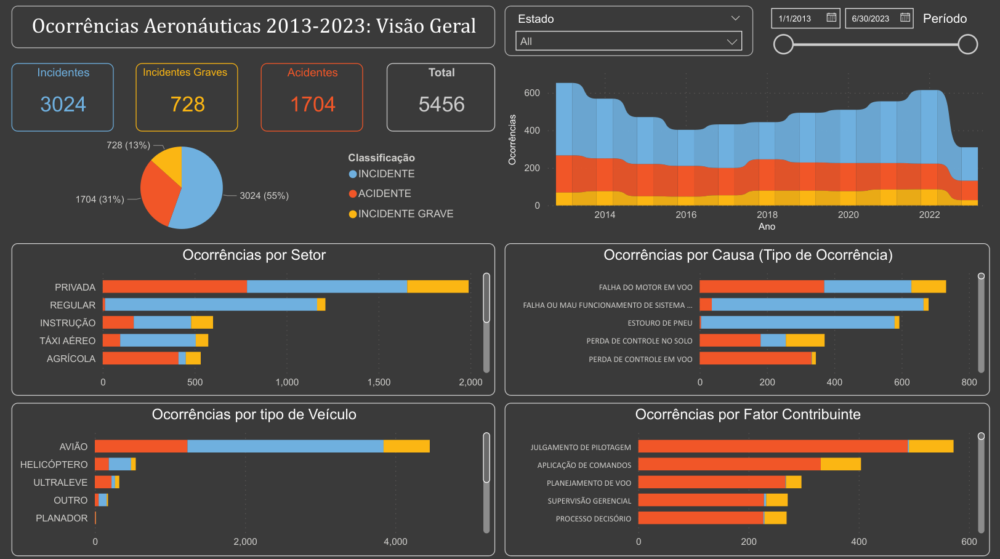
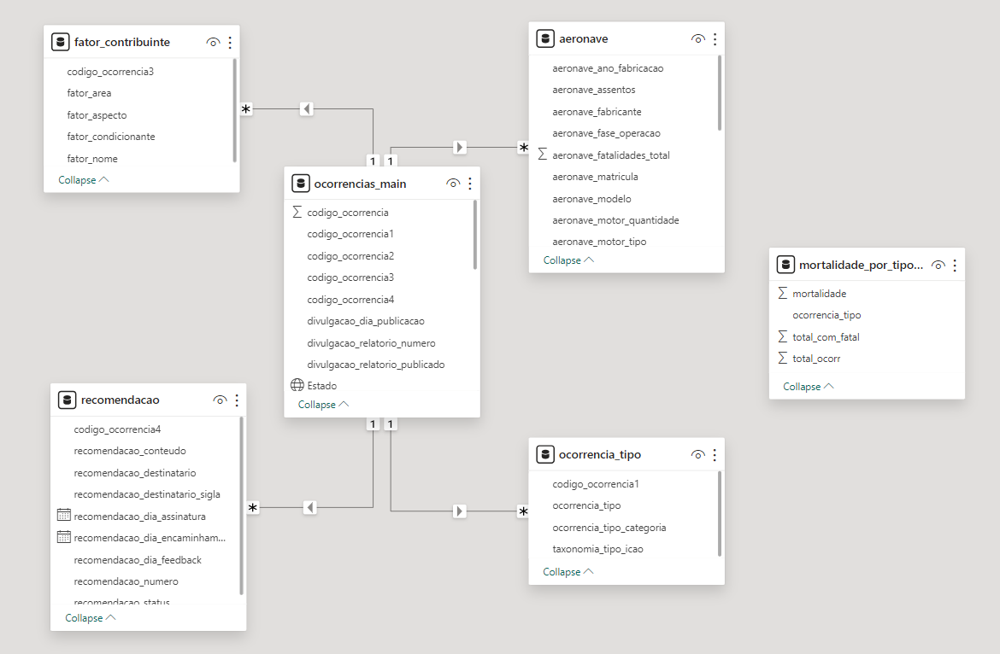

# Ocorrências Aeronáuticas 2013-2023
### Um estudo de acidentes e incidentes aeronáuticos no Brasil utilizando ***Python***, ***SQL*** e ***Power BI***

Utilizando **Python**, **SQL** e **PowerBI** este é um pequeno estudo das ocorrências aeronáuticas abrangendo o período de 2013-2023. Algumas perguntas a serem exploradas:

- Quais as principais causas de ocorrências?  
- Quais as principais causas de fatalidades em acidentes?  
- Quais os veículos mais seguros para se viajar?  
- Como as ocorrências estão distribuídas pelo território brasileiro? 

## Visão Geral dos Arquivos

- ocorr_aeron.pbix - Modelo dos dados e visualizações (dashboard) no Power BI. Onde a maioria das questões impostas são respondidas.  
- dashboard.pdf - Visualização estática do dashboard em pdf. 
- queries.sql - Queries em SQL usados para exploração de dados e criação de novas tabelas. Criados e testados usando Microsoft SQL-Server.
- coords_data_cleaning.ipynb - Python notebook onde uma extensa limpeza dos dados é efetuada, mais especificamente lidando com dados faltantes e formatação inconsistente das latitudes e longitudes.

 

    

#### Primeira página do Power BI dashboard, contendo uma visão geral dos dados.

 

    
    <figcaption> </figcaption>
 

#### Modelagem dos dados utilizando o star schema.

